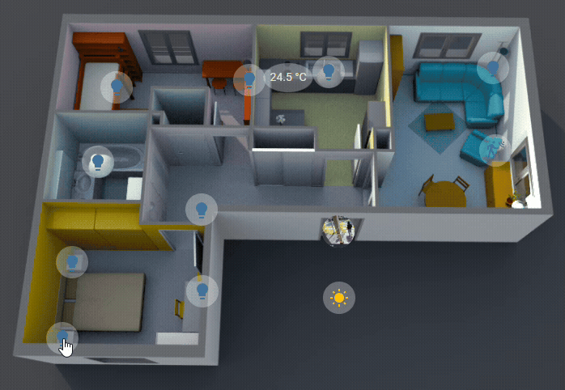
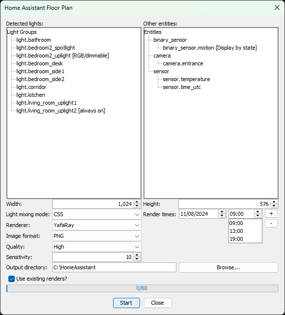
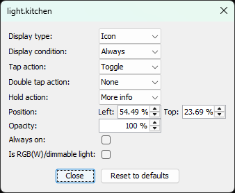
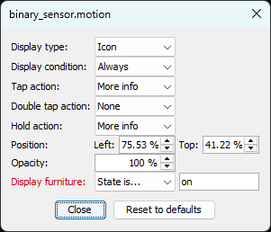
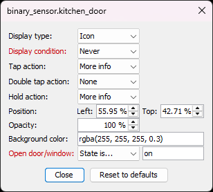

# Home Assistant Floor Plan Plugin for Sweet Home 3D

This project is a plugin for the [Sweet Home 3D](https://www.sweethome3d.com/)
interior design application.
It allows creating a 3D rendered floor plan panel for Home Assistant that
displays your home's current lighting state along with icons for toggling each
light, sensors and cameras.

## Features

* **3D Rendered Floor Plan** - Integrates with Sweet Home 3D to automatically
  generate images of your floorplan (displays current lighting state, sensors,
  and other entities with interactive icons for toggling lights)
* **Per-Room Night Rendering** - Generates a daytime base image, a night-time
  base image and, for each room, the night renders of every on/off combination
  of that room's lights
* **YAML Configuration** - Generate a YAML file with the picture-elements
  structure for easy integration with Home Assistant
* **Configuration Options** -
  * Group detected lights by room
  * Adjust output resolution
  * Select rendering engine (YafaRay / SunFlow)
  * Adjust output quality (high / low)
  * Progress bar indicates rendering status
  * Create state icons for multiple entities from Home Assistant based on their
    names
  * Lights are detected as stand-alone or within groups under SH3D
  * Caches previously rendered images to save time when generating the next
    floorplan

## How Rendering Works

For each floor plan the plugin renders three kinds of images:

1. **Base day** - A single daytime image of the whole floor with all lights
   off. It is the background shown while the sun is above the horizon.
2. **Base night** - A single night-time image of the whole floor, used as the
   background shown while the sun is below the horizon.
3. **Per-room night renders** - For every room, all on/off combinations of the
   lights located in that room are rendered at night. Lights that are not
   inside any room are rendered individually.

In Home Assistant the per-room images are overlaid on the night background with
the `lighten` blend mode, so the rooms whose lights are on light up according
to the current Home Assistant state.

Because each room renders every combination of its lights, the number of images
grows quickly with the number of switchable lights per room (`2^n - 1` images
per room with `n` lights). Keep the number of separately-switchable lights per
room small to keep the render count manageable.

> [!NOTE]
> The night renders and the night base image use the configured night time, so
> the **Night-time render** option must be enabled for this scheme to work.

## How To Use The Plugin

1. Download the latest plugin from the [releases](../../releases/latest) page
   and install it
2. Prepare your model to fit with the [criteria](#preparation) of this plugin
3. Start the plugin by clicking the "Tools"->"Home Assistant Floor Plan" menu
4. Modify the [configuration options](#configuration-options) accordingly
5. Click "Start"
6. Copy all images under `floorplan` folder to your Home Assistant path
7. Create a card of type `picture-elements` in Home Assistant and paste the
   contents of the generated `floorplan.yaml`

## Configuration Options

The configuration window displays a list of detected lights grouped according to
the room they're located in. Please verify the list matches your expectations.

* Width / Height - Configure the required output resolution of the rendered
  images
* Lights are mixed automatically per room, see
  [How Rendering Works](#how-rendering-works)
* Render time - The date and time of the rendered image, affects the sun
  position, intensity and color
* Night-time render - Sets the night render time and enables the night base
  image and the per-room night renders (see
  [How Rendering Works](#how-rendering-works)). This requires the
  [Sun](https://www.home-assistant.io/integrations/sun/) integration, which is
  enabled by default
* Light intensity - Ceiling lights and other lights use separate, configurable
  intensities, both for the per-room night renders and for the night base image
* Edge smoothing - Feathers the stamp-based cut-out edge when post-processing is
  enabled; `0` keeps a hard edge, higher values blend the floor plan outline
  more smoothly
* Renderer - Select which rendering engine to use, YafaRay or SunFlow
* Image format - The image file format of the resulting floor plan (PNG or JPEG)
* Quality - Choose the rendering quality (low or high)
* Output directory - The location on your PC where the floor plan images and
  YAML will be saved

The progress bar at the bottom will indicate how many images need to be rendered
for the complete floor plan and will progress as they are ready.

You can also click on any entity from the list to reveal additional settings
that allow you to customize the entity according to your needs.

|  |  |  |
| - | - | - |

> [!NOTE]
> Settings that were modified from their default values are displayed in red

* Display type - Configure how the entity is displayed on the floorplan, see
  [Elements](https://www.home-assistant.io/dashboards/picture-elements/#elements)
* Icon override - Allow overriding the default entity icon
* Display condition - Configure when the entity should be displayed
* Tap action - Define what to do when the entity is tapped/clicked on, see
  [Tap action](https://www.home-assistant.io/dashboards/actions/#tap-action)
* Double tap action - Define what to do when the entity is double-tapped/clicked
  on, see [Double tap Action](https://www.home-assistant.io/dashboards/actions/#double-tap-action)
* Hold action - Define what to do when the entity is held/long-pressed, see
  [Hold action](https://www.home-assistant.io/dashboards/actions/#hold-action)
* Position - Override the entity's icon/label position
* Opacity - Define the opacity of the entity's icon/label
* Background color - Define the background color of the entity's icon/label
* Display furniture - Only for furniture, set the entity state conditions for
  which the piece of furniture is either visible or hidden in the floor plan
* Open door/window - Only for door and windows, set the entity state conditions
  for which the door or window is rendered open or closed in the floor plan

  :clipboard: **Note:** For doors and windows to work, the default state of the
  model, as it comes when adding it to the floor plan, should be closed. Then,
  in your design, modify the openings to how you want them to look when opened
* Always on - Only for lights, set light as always on removing its icon and it
  won't be affected by the matching Home Assistant state
* Is RGB(W)/dimmable light - Only for lights, set light as an RGB or dimmable
  light that will change its color and brightness in the floorplan according to
  the color set in Home Assistant. This requires installing the
  [config-template-card](https://github.com/iantrich/config-template-card)
  custom Lovelace card

  :warning: **Note:** RGB/dimmable lights are only supported in the CSS
  rendering mode

## Preparation

* Set each light in SW3D with the entity name of Home Assistant, i.e.,
  `light.xxx`, `switch.xxx`
* Only light sources that are **visible** and have a **power > 0%** are
  considered
* If you have multiple light sources that are controlled by the same switch,
  e.g., spot lights, give them all the same name
* If you want to add a tool-tip to the state icon in Home Assistant, enter it
  in to the description field of the SH3D furniture
* If lights from two different rooms do interact with each other, e.g., there's
  a glass door separating the rooms, you can give both rooms the same name and
  they'll be treated as one
* To include state icons and labels for sensors, set the relevant furniture name
  to the entity name of Home Assistant, available entities for this plugin:
  * `air_quality.xxx`
  * `alarm_control_panel.xxx`
  * `assist_satellite.xxx`
  * `binary_sensor.xxx`
  * `button.xxx`
  * `camera.xxx`
  * `climate.xxx`
  * `cover.xxx`
  * `device_tracker.xxx`
  * `fan.xxx`
  * `humidifier.xxx`
  * `input_boolean.xxx`
  * `input_button.xxx`
  * `lawn_mower.xxx`
  * `light.xxx`
  * `lock.xxx`
  * `media_player.xxx`
  * `remote.xxx`
  * `sensor.xxx`
  * `siren.xxx`
  * `switch.xxx`
  * `sun.xxx`
  * `todo.xxx`
  * `update.xxx`
  * `vacuum.xxx`
  * `valve.xxx`
  * `water_header.xxx`
  * `weather.xxx`

## Suggestions

For best results, it's suggested to:
* Set the 3D view's time to 8:00 AM and disable ceiling lights

When using the "Room overlay" light mixing mode, it's also suggested to:
* Use a dark background for the 3D view
  * It can later be converted to transparent using an image editor
* Close all the doors between individually lighted rooms

## Frequently Asked Questions

* **Where should I copy the generated files and what should I copy?**
  After the process is complete, copy the floorplan folder and `floorplan.yaml`
  to your Home Assistant path, e.g., `/config/www`.

* **How do I select the desired perspective for rendering?**
  Before activating the plugin, set the SH3D project to the specific 3D point of
  view that you want to be rendered.

* **How do I change the rendering settings?**
  Prior to activating the plugin, go to "Create photo..." in the SH3D project
  and adjust the settings there. You do not need to render or save anything;
  simply make the changes and close the dialog.

* **Can I work on the SH3D project while rendering?**
  No, do not make any changes or interact with the 3D view while it’s rendering.
  These actions will be captured by the plugin as it scripts the renders one by
  one. Start the rendering process and then leave it to complete.

* **What's the difference between `renders` and `floorplan` folders?**
  The renders directory holds the raw images as generated by SH3D. The floorplan
  directory holds the post-processed images (cropped, with a transparent
  background) that you copy over to Home Assistant. The renders directory acts as
  a cache: when re-generating the floor plan with the same renders you don't have
  to wait for SH3D to ray-trace them again.

* **What's the use of `Use existing renders` option?**
  When enabled, any image that already exists from a previous run is reused
  instead of being rendered again. This lets you tweak post-processing or YAML
  settings and regenerate the floor plan in seconds without re-rendering every
  image.

## Possible Future Enhancements
- [x] Allow selecting renderer (SunFlow/Yafaray)
- [x] Allow selecting quality (high/low)
- [x] Allow selecting date/time of render
- [x] Create multiple renders for multiple hours of the day and display in Home
      Assistant according to local time
- [x] Allow stopping rendering thread
- [X] Allow enabling/disabling/configuring state-icon
- [x] Support including sensors state-icons/labels for other items
- [ ] Support fans with animated gif/png with css3 image rotation
- [x] Make sure state-icons/labels do not overlap
- [x] Allow using existing rendered images and just re-create overlays and YAML
- [ ] After rendering is complete, show preview of overlay images
- [x] Allow overriding state-icons/labels positions, and save persistently
- [X] Allow defining, per entity, if it should be an icon or label, and save
      that persistently
